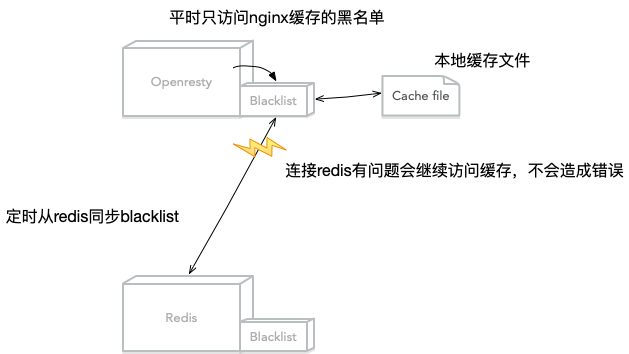

# lua-resty-access-control

Openresty 访问控制 ，利用 Redis 实现多个入口集中管理

- 支持设置有效期
- 支持服务降级
- API
- WEB 界面（待整理）

# 目录

- [lua-resty-access-control](#lua-resty-access-control)
- [目录](#%E7%9B%AE%E5%BD%95)
- [工作原理](#%E5%B7%A5%E4%BD%9C%E5%8E%9F%E7%90%86)
- [必要条件](#%E5%BF%85%E8%A6%81%E6%9D%A1%E4%BB%B6)
- [快速开始](#%E5%BF%AB%E9%80%9F%E5%BC%80%E5%A7%8B)
    - [1. 上传 lua 程序](#1-%E4%B8%8A%E4%BC%A0-lua-%E7%A8%8B%E5%BA%8F)
    - [2. 分配 nginx 本地缓存黑名单、设置同步任务](#2-%E5%88%86%E9%85%8D-nginx-%E6%9C%AC%E5%9C%B0%E7%BC%93%E5%AD%98%E9%BB%91%E5%90%8D%E5%8D%95%E8%AE%BE%E7%BD%AE%E5%90%8C%E6%AD%A5%E4%BB%BB%E5%8A%A1)
    - [3. 修改同步 Redis 配置](#3-%E4%BF%AE%E6%94%B9%E5%90%8C%E6%AD%A5-redis-%E9%85%8D%E7%BD%AE)
    - [4. 添加限制配置](#4-%E6%B7%BB%E5%8A%A0%E9%99%90%E5%88%B6%E9%85%8D%E7%BD%AE)
    - [5. reload nginx](#5-reload-nginx)
    - [6. 测试](#6-%E6%B5%8B%E8%AF%95)
        - [6.1 确认添加黑名单前正常访问](#61-%E7%A1%AE%E8%AE%A4%E6%B7%BB%E5%8A%A0%E9%BB%91%E5%90%8D%E5%8D%95%E5%89%8D%E6%AD%A3%E5%B8%B8%E8%AE%BF%E9%97%AE)
        - [6.2 添加 ip 到黑名单](#62-%E6%B7%BB%E5%8A%A0-ip-%E5%88%B0%E9%BB%91%E5%90%8D%E5%8D%95)
        - [6.3 测试添加黑名单后](#63-%E6%B5%8B%E8%AF%95%E6%B7%BB%E5%8A%A0%E9%BB%91%E5%90%8D%E5%8D%95%E5%90%8E)
        - [6.4 从黑名单删除 key](#64-%E4%BB%8E%E9%BB%91%E5%90%8D%E5%8D%95%E5%88%A0%E9%99%A4-key)
- [API 文档（待整理)](#api-%E6%96%87%E6%A1%A3%E5%BE%85%E6%95%B4%E7%90%86)
- [WEB (待整理)](#web-%E5%BE%85%E6%95%B4%E7%90%86)

# 工作原理



# 必要条件

- openresty >= 1.11.2.4 (library: [lua-nginx-module](https://github.com/openresty/lua-nginx-module),[lua-resty-redis](https://github.com/openresty/lua-resty-redis),[cjson](https://www.kyne.com.au/~mark/software/lua-cjson.php))
- redis

# 快速开始

## 1. 上传 lua 程序

本例上传到/data/svr/openresty/lualib/access_control

## 2. 分配 nginx 本地缓存黑名单、设置同步任务

修改 nginx.conf，在 http 配置块下，第一个 server 前添加：

```
...
http
{
    # 由 Nginx 进程分配一块 10M 大小的共享内存空间，用来缓存 IP 黑名单
    lua_shared_dict ip_blacklist 10m;

    # 在初始化 nginx worker 时开启同步定时任务
    init_worker_by_lua_file /data/svr/openresty/lualib/access_control/sync.lua;
...
```

## 3. 修改同步 Redis 配置

```
vim openresty/lualib/access_control/config.lua
```

```
...
-- redis ip
_M.redis_host = "127.0.0.1"

-- redis port
_M.redis_port = 6379
...
```

## 4. 添加限制配置

在需要限制的 http、server 或 location 块下添加以下配置

```
vim nginx.conf
```

```
...
http {
    access_by_lua_file /data/svr/openresty/lualib/access_control/access_filter.lua;
...
```

## 5. reload nginx

```
/data/sh/openresty configtest && /data/sh/openresty reload
```

## 6. 测试

### 6.1 确认添加黑名单前正常访问

```
curl -I http://127.0.0.1
# HTTP/1.1 200 OK
```

### 6.2 添加 ip 到黑名单

```
# 添加IP 127.0.0.1到黑名单，无过期
redis-cli set ngx:access_control:ip_blacklist:127.0.0.1 {\"expireat\":0}

# 添加IP 127.0.0.2到黑名单，60秒有效期。注意：这里写入value是60秒后的时间戳
redis-cli set ngx:access_control:ip_blacklist:127.0.0.2 {\"expireat\":$((`date +%s` + 60))} EX 60
```

### 6.3 测试添加黑名单后

因为有同步间隔，所以新添加黑名单最长生效时间=同步时间，配置见 3

```
curl -I http://127.0.0.1
# HTTP/1.1 403 Forbidden
```

### 6.4 从黑名单删除 key

```
# 从黑名单删除IP 127.0.0.1
redis-cli del ngx:access_control:ip_blacklist:127.0.0.1
```

# API 文档（待整理)

[API 文档](docs/api.md)

# WEB (待整理)
